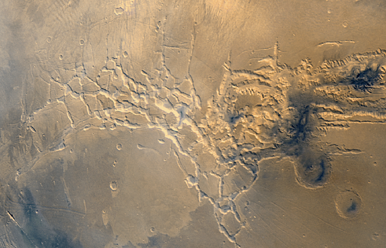

# [Knights of Cydonia](https://www.youtube.com/watch?v=G_sBOsh-vyI)

Little is known about the mysterious Mars' labyrinths, enormous structures carved into the surface of the red planet, extending for thousands of kilometers and drawing almost lugubrious patterns on the surface of the planet. Scientists attribute the origin of these labyrinths to the prolonged action of the elements which, over millions of years, have carved these structures into the Martian soil. 

But in 2056 a set of robotic probes sent by DIANA for private exploration purposes (they were searching for available free parking spots on Mars given the unbearable situation in Turin) discovered an intricate network of tunnels underneath the surface in the Cydonia region, right close to the infamous formation known as the "Face on Mars". The rovers were able to send back radar data of the tunnels before they were lost for unknown reasons (probably just a software defect, plenty of those), but the team was able to recover the data and they couldn't believe what they found: the network of tunnels seems to be of artificial origin! Not only that, but it looks as if it contains a secret encoded message. 

If confirmed, this would be an unprecedented discovery. The team is now asking for your help to decode the message. Can you help them decipher the message before those boring JPL guys get their hands on it?

## Instructions
``labyrinth.txt`` contains all the information you need to solve this challenge. 

## Expected deliverables
- One .txt file containing the message
- The code you used to get the result

## Challenge's Score
Total Score: 400
